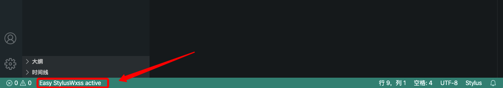

# vscode-plugin-easy-wxstylus README

a pure plugin 

the plugin is working when you see this 

## Features

[X] convert stylus file to wxss when on save

## Known Issues

performance is not good

## Release Notes

### 1.0.0
enjoy stylus

